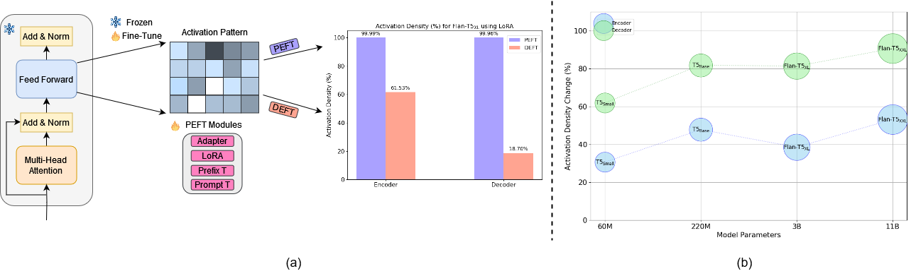

<h1 align="center">From PEFT to DEFT: Parameter Efficient Finetuning for Reducing Activation Density in Transformers </h1>
<p align="center"> <a href="https://bharat-runwal.github.io/" target="_blank id="website">Bharat Runwal</a><sup>1</sup>, Tejaswini Pedapati<sup>2</sup>, <a href="https://sites.google.com/site/pinyuchenpage/home" target="_blank id="website">Pin-Yu Chen</a><sup>2</sup></p>
<p align="center"><sup>1</sup> Independent Researcher,<sup>2</sup> IBM Research</p>

<!-- <p align="center">
  <a href="https://arxiv.org/pdf/22s08.01853.pdf" alt="ArXiv">
        </a>
</p> -->

<p align="center">
  
</p>

## Abstract 
- Pretrained Language Models (PLMs) have become the de facto starting point for fine-tuning on downstream tasks. However, as model sizes continue to increase, traditional fine-tuning of all parameters becomes challenging. To address this, parameter-efficient fine-tuning (PEFT) methods have gained popularity as a means to adapt PLMs effectively. In parallel, recent studies have revealed the presence of activation sparsity within the intermediate outputs of the multilayer perception (MLP) blocks in transformers. Low activation density enables efficient model inference on sparsity-aware hardware. Building upon this insight, in this work, we propose a novel density loss that encourages higher activation sparsity (equivalently, lower activation density) in the pre-trained models. We demonstrate the effectiveness of our approach by utilizing mainstream PEFT techniques including QLoRA, LoRA, Adapter, Prompt/Prefix Tuning to facilitate efficient model adaptation across diverse downstream tasks. Experiments show that our proposed method DEFT, Density-Efficient Fine-Tuning, can reduce the activation density consistently and Up to **50.72%** on RoBERTa<sub>Large</sub>, and **53.19%** (encoder density) and **90.60%** (decoder density) on Flan-T5<sub>XXL</sub> (**11B**) compared to PEFT using GLUE and QA (SQuAD) benchmarks respectively while maintaining competitive performance on downstream tasks. We also showcase that DEFT works complementary with quantized and pruned models. . 

## Installation
To run the code, first you need to install [adapter-transformers](https://github.com/adapter-hub/adapters/tree/master) for Adapter and LoRA experiments:
```
pip install -U adapter-transformers
```
For Prompt-Tuning and Prefix-Tuning we used [PEFT](https://github.com/huggingface/peft) Library:
```
pip install PEFT
```

## Run the code
### GLUE Benchmark Experiment 

- To run DEFT with Adapter module and roberta-large model on SST2 Dataset with Seed 42 :
```
bash glue.sh deft 42 sst2 
```
For PEFT, you can change the "deft" to "peft". 
You can follow similar script for all the other modules.

### SQuAD Experiment

- To run Flan-T5<sub>XL</sub> with DEFT you can use the following :
```
bash squad.sh deft 42 
```

